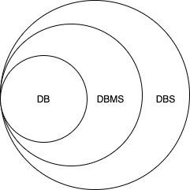

# 数据库的安装

* mysql的服务器端

  右击计算机 - 管理 - 服务 - 服务和应用程序 - 右边的窗口

  保证mysql服务处于运行状态,***设置开启自启动***,手动启动.

* mysql的客户端

  * 自带的,控制台进入.
  * navicat - 收费的软件
    * 红色的 - oracle
    * 绿色的 - mysql
    * 黄色的 - 通用的
  * idea

mysql[免费,开源]和oracle数据库(orcl版本[企业版],xe版本(绿色版)都是属于Oracle公司.

* mysql - 是以仓库的方式来管理数据的 - 创建很多个仓库.

* oracle - 是以用户的方式来管理数据的 - 不鼓励程序员自己创建仓库.总共就一个特别大的仓库.

  然后创建很多不同权限的账号.每个账户登录的时候,只能看到自己创建的信息.

# 认识数据库

数据库（Database - DB）是按照**数据结构来组织、存储和管理数据的**仓库，

我们也可以将数据存储在文件中，但是在文件中读写数据速度相对较慢。

所以，现在我们使用**关系(表)型**数据库管理系统（RDBMS）来存储和管理的大数据量。

RDBMS即关系型数据库管理系统(Relational Database Management System)的特点：

1. 数据以**表格**的形式出现
2. 每行(**元组)**为各种**记录**名称
3. **每列**为记录名称所对应的**数据域[Field]**
4. 许多的行和列组成一张表
5. 若干的表单组成database

## 数据库分类

早期比较流行的数据库模型有三种，分别为层次式数据库、网络式数据库和关系型数据库。

 而在当今的互联网中，最常用的数据库模型主要是两种，即` 关系型数据库 `和` 非关系型数据库 `。

### 关系型数据库

关系型数据库模型是把复杂的数据结构归结为简单的二元关系（即二维表格形式）。 

主流的关系型数据库有如下:

1. oracle数据库 - Oracle公司是最早开发关系型数据库的厂商之一.版本升级：oracle8i，oracle9i，oracle10g，oracle11g，oracle12c

2. **mysql数据库** - 被广泛的应用在Internet上的大中小型网站中。由于体积小、速度快、总体拥有成本低，开放源代码

3. SQL Server数据库 -   Microsoft SQL Server是微软公司开发的大型关系数据库系统

其他不常见的关系型数据库:DB2，PostgreSQL，Informix，Sybase等。这些关系型数据库逐步的淡化了普通运维的实现，特别是互联网公司几乎见不到

### Nosql

* mongodb - 文档数据库 - 评论的数据(比较多,但是不重要)
* redis - 键值对数据库

#### RDBMS概念

* ***数据库: 数据库是一些关联表的集合。***
* ***数据表: 表是数据的矩阵。在一个数据库中的表看起来像一个简单的电子表格。***
* ***列: 一列(数据元素,Field域) 包含了相同的数据, 例如邮政编码的数据。***
* ***行：一行（=元组，或记录）是一组相关的数据，例如一条用户订阅的数据。***
* ***冗余：存储两倍数据，冗余降低了性能，但提高了数据的安全性。***
* 主键：主键是唯一的。一个数据表中只能包含一个主键。你可以使用主键来查询数据。
* 外键：外键用于关联两个表。
* 复合键：复合键（组合键）将多个列作为一个索引键，一般用于复合索引。
* 索引：使用索引可快速访问数据库表中的特定信息。索引是对数据库表中一列或多列的值进行排序的一种结构。类似于书籍的目录。
* 参照完整性: 参照的完整性要求关系中不允许引用不存在的实体。与实体完整性是关系模型必须满足的完整性约束条件，目的是保证数据的一致性。

### 非关系型数据库

非关系型数据库也被成为NoSQL数据库，NOSQL的本意是“Not Olnly SQL”.

NOSQL非关系型数据库小结： 

1. NOSQL不是否定关系数据库，而是作为关系数据库的一个重要补充 
2. NOSQL为了**高性能、高并发而生**，忽略影响高性能，高并发的功能 
3. NOSQL典型产品memcached （纯内存），**redis**（持久化缓存),` mongodb `(文档的数据库)

-----

**MongoDB**是一个介于关系型数据库和非关系型数据库之间的产品，是非关系型数据库当中功能最丰富，

最像关系数据库的。**他支持的数据库结构非常松散，类似json的bjson格式**，因此可以存储比较复杂的数据类型。

Mongodb最大的特点是他支持的查询语言非常强大，其语法有点类似于面向对象的查询语言，几乎可以实现类似关系数据库单表查询的绝大部分功能，而且还支持对数据建立索引。 

~~~java
项目中比如评价的数据 - mongodb中 - 多,价值低,极端场景 - 并发比较高
redis - 秒杀.
~~~

## 专业术语

>1. DBMS 
>
>>DBMS 数据库管理系统(Database Management System)是一种操纵和管理数据库的大型软件
>>
>>用于建立、使用和维护数据库，简称DBMS。它对数据库进行统一的管理和控制,保证数据库的安全性和完
>>
>>整性。用户通过DBMS访问数据库中的数据，数据库管理员也通过dbms进行数据库的维护工作。

>2. DBA
>
>>数据库管理员（Database Administrator，简称DBA），是从事管理和维护数据库管理系统(DBMS)的相关工作人员的统称
>>
>>他属于运维工程师的一个分支，主要负责业务数据库从设计、测试到部署交付的全生命周期管理。DBA的核心目标是保证数据库管理系统的稳定性、安全性、完整性和高性能。
>>
>>在国外，也有公司把DBA称作数据库工程师(Database Engineer)，两者的工作内容基本相同，
>>
>>都是保证数据库服务7*24小时的稳定高效运转，但是需要区分一下DBA和数据库开发工程师(Database Developer)：
>>
>>1) 数据库开发工程师的主要职责是设计和开发数据库管理系统和数据库应用软件系统，侧重于软件研发；
>>
>>2) DBA的主要职责是运维和管理数据库管理系统，侧重于运维管理。

>3. DBS
>
>>数据库系统DBS（Data Base System，简称DBS）通常由软件、数据库和数据管理员组成。
>>
>>其软件主要包括操作系统、各种宿主语言、实用程序以及数据库管理系统。数据库由数据库
>>
>>管理系统统一管理，数据的插入、修改和检索均要通过数据库管理系统进行。
>>
>>数据管理员负责创建监控和维护整个数据库，使数据能被任何有权使用的人有效使用。
>>
>>可以理解成:DBS = DBMS(核心)+DBA+DB

​                                                           

# 预备工作

* 登录

  ~~~mysql
  mysql -uroot -proot
  ~~~

* 创建数据库(j08)

  ~~~mysql
  create database j08;
  
  -- 检查一下
  show databases;
  ~~~

* 使用数据库

  ~~~mysql
  use j08
  ~~~

# 导入sql脚本

预先在j08仓库下创建了若干张表,以及向这些表中插入了一些数据.

~~~mysql
use j08
show tables;
mysql> source /Users/admin/Desktop/j08_mysql_all/j08_mysql/ 教学脚本/mysql_cn.sql ;
~~~

## Mysql命令

* 查看数据库编码

  ~~~msyql
  mysql> show variables like 'character_set%';
  +--------------------------+-----------------------------------------------------------+
  | Variable_name            | Value                                                     |
  +--------------------------+-----------------------------------------------------------+
  | character_set_client     | utf8                                                      |
  | character_set_connection | utf8                                                      |
  | character_set_database   | utf8                                                      |
  | character_set_filesystem | binary                                                    |
  | character_set_results    | utf8                                                      |
  | character_set_server     | utf8                                                      |
  | character_set_system     | utf8                                                      |
  | character_sets_dir       | /usr/local/mysql-5.7.28-macos10.14-x86_64/share/charsets/ |
  +--------------------------+-----------------------------------------------------------+
  8 rows in set (0.01 sec)
  ~~~
  
* 查看所有的数据库

  学习数据字典,再来看这些默认的仓库.
  
  ~~~mysql
  mysql> show databases;
  +--------------------+
  | Database           |
  +--------------------+
  | information_schema |               
  | mysql              |
  | performance_schema |           
  | sys                |
  +--------------------+
  ~~~
  
* 删除数据库

  drop database 数据库名称;
  
  ~~~mysql
  drop database j08;
  ~~~
  
* **使用数据库 - 千万不要忘记**

  ~~~mysql
  use j08
  ~~~
  
* 查看某个仓库下的所有的表

  ~~~mysql
  show tables;
  ~~~
  
  
  
* 查看某张表的表结构

  ***desc 表名;***

  ~~~mysql
  mysql> desc s_emp;
  +----------------+--------------+------+-----+---------+-------+
  | Field          | Type         | Null | Key | Default | Extra |
  +----------------+--------------+------+-----+---------+-------+
  | id             | int(7)       | NO   | PRI | NULL    |       |
  | last_name      | varchar(25)  | YES  |     | NULL    |       |
  | first_name     | varchar(25)  | YES  |     | NULL    |       |
  | userid         | varchar(8)   | YES  | UNI | NULL    |       |
  | start_date     | date         | YES  |     | NULL    |       |
  | comments       | varchar(255) | YES  |     | NULL    |       |
  | manager_id     | int(7)       | YES  |     | NULL    |       |
  | title          | varchar(25)  | YES  |     | NULL    |       |
  | dept_id        | int(7)       | YES  |     | NULL    |       |
  | salary         | float(11,2)  | YES  |     | NULL    |       |
  | commission_pct | float(4,2)   | YES  |     | NULL    |       |
  +----------------+--------------+------+-----+---------+-------+
  ~~~

  

# 认识SQL

**结构化查询语言(非过程化查询语言)**(Structured Query Language)简称SQL，是一种特殊目的的编程语言，是一种数据库查询和程序设计语言，用于存取数据以及查询、更新和管理关系数据库系统。

sql只能操作关系型数据库.市面上的关系型数据库(RDBMS),它们90%的sql语句几乎一样的.通过sql语句来操作DB

## sql按照功能分类

* DCL(Data Control Language) - 数据控制语言

  grant(授权),revoke(取消权限)

* DDL(Data Definition Language) - 数据定义语言

  create,drop,alter,rename to,comment on,truncate...

* DML(Data Manipulation Language) - 数据操纵语言

  insert,update,delete

* DQL(Data Query Language) - 数据查询语言

  select

# 简单查询

简介:sql的命令是大小写不敏感的.在公司中推荐使用大写.

查询的本质:

* 到哪里查[确定哪张表]
* 查什么[查的列]

~~~mysql
SELECT 列1,列2[,列n] FROM 表名;
~~~

## 简单查询练习

~~~mysql
-- 找出员工的所有的信息;*代替所有的列(企业中不允许)
select * from s_emp;

-- 从s_emp表中查询出员工的名字,薪水,职位;
select first_name,salary,title from s_emp;
-- 从s_emp表中查出员工的姓氏,名字;
select last_name,first_name from s_emp;

-- 找出本公司的所有的职称(title);
select title from s_emp;

-- 补充 - title发现有大量重复的,排重关键字distinct
select distinct title from s_emp;

-- 找出所有员工的姓名、工资、入职日期
select last_name,first_name,salary,start_date from s_emp;

-- 找出所有的客户名及他的电话号码
select name,phone from s_customer;

-- 找出员工姓名及他的职称
select last_name,first_name,title from s_emp;

-- 找出每个订单的费用、支付方式、出货日期
select total,payment_type,date_ordered from s_ord;
~~~

**示:如果不知道表中的列名,可以再次通过desc 表名来查询表结构进行窥探**

## 基础查询

* sql语句具有运算的能力 - 列是可以参加计算的

  ~~~mysql
  -- 查询员工的名字,他的年薪(不包含提成)
  select first_name,salary*12 from s_emp;
  ~~~

* sql语句具有字符串拼接能力.

  **mysql - 字符串拼接函数concat(param... p);**

  ~~~mysql
  mysql> select concat(last_name,' ',first_name) from s_emp;
  ~~~

* 给列取别名

  select 列1 列别名,列2 列别名2 from 表名;
  
  select 列1 as 列别名,列2 as 列别名2 from 表名;
  
  select 列1 "列别名",列2 "列别名2"  from 表名;
  
  select 列1 as "列别名",列2 as "列别名3" from 表名;
  
  ~~~mysql
  mysql>select salary*12 年薪 from s_emp;
  mysql>select salary*12 as 年薪 from s_emp;
  mysql>select salary*12 "年薪" from s_emp;
  mysql>select salary*12 as "年薪" from s_emp;
  
  mysql中的字符串都是使用单引号表示,双引号作用是用来包裹格式.
  mysql>select salary*12 年 薪 from s_emp;//error
  mysql>select salary*12 "年 薪" from s_emp;
  ~~~
  
* 空值置换函数**coalesce(m,n)相当于m==null?n:m**

  ~~~mysql
  -- 输出员工的id,firstname以及员工的年薪[包含提成]
  mysql>select id,first_name,salary*12*(1+commission_pct/100) 年薪 from s_emp;
  发现只有有提成的员工的年薪才能正常显示出来.
  结论:null的列参加计算的时候,结果是为null.
  
  mysql>select id,first_name,salary*12*(1+coalesce(commission_pct,0)/100) 年薪 from s_emp;
  ~~~
  

# 条件查询

带条件进行筛选查询.

语法:

~~~mysql
SELECT * FROM 表名
WHERE 条件表达式1 [and/or 条件表达式2];

oracle:条件表达式执行的顺序从右到左.
mysql:条件表达式执行的顺序从左到右.
~~~

* 比较运算符

  ~~~java
  > < >= <= <> =
  ~~~

* 其他运算符

  ~~~java
  between m and n 闭区间[m,n],在[m,n]之间
  in 在...什么以内
  not in 不在...以内
  sql语句优化的时候,不建议使用not in语法的 - 导致索引失效
  
  注意的是,null值的判断不能使用=
  is null 判断为空
  is not null 判断不为空
  ~~~

* 逻辑运算符

  ~~~mysql
  and - 连接条件表达式,当所有表达式同时成立,结果为true.
  
  or - 连接条件表达式,只要一个为true,结果就是true
  ~~~

# 模糊查询

使用like关键字,占位符

* % - 任意多个任意字符
* _ 任意单个字符

~~~mysql
-- 比如查询first_name中包含c的员工.
select first_name from s_emp where first_name like '%c%';//模糊查询大小写不敏感

-- 查询第三个字母是a
mysql>select first_name from s_emp where first_name like '__a%';
~~~

mysql中也是支持转义字符 - 默认的转义字符\

~~~mysql
如果first_name中本身就已经包含了%
mysql>update s_emp set first_name='Car%men' where id=1;
mysql>update s_emp set first_name='Mar%k' where id=4;

-- 查询first_name中包含%的员工的信息
mysql>select * from s_emp where first_name like '%\%%';
~~~

通过escape关键字来定义指定的转义字符

~~~mysql
select * from s_emp where first_name like '%?%%' escape '?';
~~~

#  条件查询和模糊查询练习

1. 查出在41部门的员工名字,工资

   ~~~sql
   mysql>select first_name,salary from s_emp where dept_id=41;
   ~~~

2. 查出工资高于1500的员工的信息

   ~~~sql
   mysql>select id,first_name,salary from s_emp where salary>1500;
   ~~~

3. 找出工资大于1200元的员工全名、工资、职称

   ~~~sql
   mysql>select concat(last_name,' ',first_name) 姓名,salary,title from s_emp where salary>1200;
   ~~~

4. 查出在41,42,50部门的员工名,薪水

  ~~~mysql
  mysql>select first_name,salary,dept_id from s_emp where dept_id=41 or dept_id=42 or dept_id=50;
  
  mysql>select first_name,salary,dept_id from s_emp where dept_id in(41,42,50);
  ~~~
  
  
  
5. 找出工资在1200到1500之间的员工名

   ~~~sql
   mysql>select first_name,salary from s_emp where salary>=1200 and salary<=1500;
   
   mysql>select first_name,salary from s_emp where salary between 1200 and 1500;
   ~~~

6. 找出工资大于1500并且没有提成的员工

   ~~~sql
   mysql>select first_name,salary from s_emp where commission_pct is null and salary>1500;
   ~~~

7. **查出名字是以M打头的员工**

   %类似量词*(零次或者多次)

   ~~~sql
   mysql>select first_name from s_emp where first_name like 'M%';
   ~~~

8. **查出姓名中第三个字母是e的员工**

   ~~~sql
   mysql>select first_name from s_emp where first_name like '__e%';
   ~~~

9. 找出没有提成率的员工

   ~~~sql
   mysql>select first_name from s_emp where commision_pct is null;
   
   mysql>select first_name from s_emp where coalesce(commission_pct,0)=0;
   ~~~

10. 找出费用超过10000元的订单编号及支付方式

   ~~~sql
   mysql>select id,payment_type,total from s_ord where total>10000;
   ~~~

11. 找出工资在950(含)至1200(含)元的员工姓名、职称

    ~~~sql
    mysql>select first_name,title,salary from s_emp where salary between 950 and 1200;
    ~~~

12. **找出名字first_name中含有字母a的员工**

    ~~~sql
    mysql>select first_name from s_emp where first_name like '%a%';
    ~~~

    

# 排序语句

数据量大的时候,order by语句是禁止使用,性能很低很低.

~~~mysql
SELECT 列 From 表名
WHERE 条件语句
ORDER BY 列 [ASC|DESC]

ASC - 升序 - 默认可以不写.
DESC - 降序
~~~

1. 查询出职称是Stock Clerk的员工全名、工资，并按工资降序排序

   ~~~sql
   order by 后面可以跟什么东西?
   
   -- 直接跟的列名
   mysql>select concat(last_name,' ',first_name) 姓名,salary,title
         from s_emp where title='stock clerk' order by salary desc;
    
   -- 跟列别名
   mysql>select concat(last_name,' ',first_name) 姓名,salary _sal,title
         from s_emp where title='stock clerk' order by _sal desc;
   
   -- 跟查询列的序号,mysql中序号从1开始 - 推荐的.
   mysql>select concat(last_name,' ',first_name) 姓名,salary _sal,title
         from s_emp where title='stock clerk' order by 2 desc;
   ~~~
   
2. 查询出职称中带VP的员工名字,工资,并按工资的降序排序

   ~~~sql
   mysql>select first_name,salary,title from s_emp where title like '%VP%' order by 2 desc;
   ~~~

   

3. 查询出年薪低于25000的员工名,职称,并按年薪升序排序,如果年薪一样,继续根据first_name降序排.

   ~~~mysql
   mysql>select first_name,title,salary*12*(1+coalesce(commission_pct,0)/100) year_salary from s_emp where salary*12*(1+coalesce(commission_pct,0)/100)<25000 order by 3,1 desc;
   
   mysql>子查询 - 把查询出来的结果作为"虚拟表".
   
   select * from(
   select first_name,title,salary*12*(1+coalesce(commission_pct,0)/100) year_salary from s_emp) core_ order by 3,1 desc;
   
   ~~~

# 补充case ..when..then..else..end语法

~~~mysql
mysql>select id,name,
	case region_id
		when 1 then '北美'
		when 2 then '南美'
		when 3 then '非洲/中东'
		when 4 then '亚洲'
		else '未知区域'
	end 区域名 from s_dept;
	
-- 工资高于1500的,显示土豪
   工资[1200,1500],显示中产
   工资低于1200,显示拖后腿
mysql>select id,first_name,salary,
      case
      	when salary>1500 then '土豪'
      	when salary>=1200 and salary<=1500 then '中产'
        else '拖后腿'
      end 工资等级 from s_emp;
~~~

# mysql单行函数

简介:100%不会用.了解.

## 字符串函数

1. instr(str,substr) - 返回字符串substr在字符串str第一次出现的位置(str不包含substr时返回0)

   ~~~mysql
   mysql>select instr('ppopo','o');//3,找不到则返回0
   ~~~

2. lpad(str,len,padstr) - 用字符串padstr填补str左端直到字串长度为len并返回 

3. rpad(str,len,padstr) - 用字符串padstr填补str右端直到字串长度为len并返回

   ~~~mysql
   mysql>select rpad('abc',6,'do');//abcdod
   ~~~

4. left(str,len) - 返回字符串str的左端len个字符 

5. right(str,len) - 返回字符串str的右端len个字符 

6. substring(str,pos,len) - 返回字符串str的位置pos起len个字符  

7. substring(str,pos) - 返回字符串str的位置pos起后面的子串 

8. ltrim(str) - 返回删除了左空格的字符串str  

9. rtrim(str)  - 返回删除了右空格的字符串str  

10. space(n) - 返回由n个空格字符组成的一个字符串  

11. ***replace(str,from_str,to_str)  - 用字符串to_str替换字符串str中的子串from_str并返回*** 

12. reverse(str) - 颠倒字符串str的字符顺序并返回

13. insert(str,pos,len,newstr) - 把字符串str由位置pos起len个字符长的子串替换为字符串

    ~~~mysql
    mysql>select insert('Carmen',2,5,'*****');
    ~~~

14. lower(str) - 返回小写的字符串str  

15. upper(str) - 返回大写的字符串str

16. char_length(str) -  不管汉字还是数字或者是字母都算是一个字符。

17. length(str);//汉字占3个,其他占1个.

结合实际的表来进行操作.

把所有的first_name全部转换成大写

~~~mysql
mysql>select upper(first_name) from s_emp;
~~~

函数是可以嵌套函数使用的.

~~~mysql
mysql>select upper(substring(first_name,1,1)) from s_emp;
~~~

### 练习

* 模拟银行的first_name模糊显示

  ~~~mysql
  first_name    xxx
  Carmen        C*****
  Mark          M***
  
  mysql>select first_name,rpad(substring(first_name,1,1),char_length(first_name)-1,'*') from s_emp;
  
  mysql>select first_name,replace(first_name,substring(first_name,2),rpad('*',char_length(first_name)-1,'*')) from s_emp;
  
  mysql> select first_name,concat(substring(first_name,1,1),rpad('*',char_length(first_name)-1,'*')) from s_emp;
  
  mysql>select first_name,insert(first_name,2,char_length(first_name)-1,rpad('*',char_length(first_name)-1,'*')) from s_emp;
  ~~~
  
  

## 数字函数

1. abs(n) - 求绝对值

2. mod(n,m) - 取模运算,返回n被m除的余数(同%操作符)

3. **floor(n) - 返回不大于n的最大整数值** - 向下取整  

4. **ceiling(n) - 返回不小于n的最小整数值**  - 向上取整 

5. round(n[,d]) - 返回n的四舍五入值,保留d位小数(d的默认值为0)

   ~~~mysql
   mysql>select round(3.5);
   
   mysql>select round(3.456,2);//3.46
   ~~~

6. pow(x,y) - 返回值x的y次幂  

7. sqrt(n) - 返回非负数n的平方根

8. pi() - 返回圆周率  

9. rand() - 返回在范围[0到1.0)内的随机浮点值

10. truncate(n,d) - 保留数字n的d位小数并返回  - 直接截取

    ~~~mysql
    mysql>select truncate(3.56,0);//3
    ~~~

### 练习

~~~sql
-- 求1-3之间的随机整数
mysql>select truncate(rand()*3+1,0);

mysql>select floor(rand()*3+1);
~~~

## 日期函数

查询当前系统的日期 - select now();

1. dayofweek(date) - 返回日期date是星期几(1=星期天,2=星期一,……7=星期六,odbc标准)  

2. weekday(date) - 返回日期date是星期几(0=星期一,1=星期二,……6= 星期天)

3. year(date) - 返回date的年份(范围在1000到9999)    

4. month(date)  - 返回date中的月份数值   

5. dayofmonth(date) - 返回date是一月中的第几日(在1到31范围内)   

6. hour(time) - 返回time的小时数(范围是0到23)  

7. minute(time) - 返回time的分钟数(范围是0到59) 

8. second(time) - 返回time的秒数(范围是0到59) 

9. period_add(p,n) - 增加n个月到时期p并返回(p的格式yymm或yyyymm) 

   mysql>select period_add('202008',3) ;

   mysql>select period_add(date_format(now(),'%Y%m'),2);

10. period_diff(p1,p2) - 返回在时期p1和p2之间月数(p1和p2的格式yymm或yyyymm)  p1-p2

11. curdate() - 以'yyyy-mm-dd'或yyyymmdd格式返回当前日期值(根据返回值所处上下文是字符串或数字) 

12. curtime() - 以'hh:mm:ss'或hhmmss格式返回当前时间值(根据返回值所处上下文是字符串或数字)

13. now() - 以'yyyy-mm-dd hh:mm:ss'或yyyymmddhhmmss格式返回当前日期时间(根据返回值所处上下文是字符串或数字)     

14. last_day(date) - date日期所在月的最后一天是什么时候

15. datediff(d1,d2) - 两个日期d1,d2之间相差的天数

16. timestampdiff(type,d1,d2) - type是YEAR,d1和d2相差的年份,MONTH,月份

    d1,d2 - yyyymmdd

mysql中,虽然日期date_format函数来转成字符串类型的,mysql内部为了简化我们的写法,有的时候有的函数.

只要你传入的字符串满足一定的格式,那么它就会自动被转成日期函数.

## 日期函数补充

* date_add(date,interval expr type)
* date_sub(date,interval expr type)

~~~sql
type:
year
month
day
hour
minute
second
~~~

### 日期格式化

date_format(date,format)    

~~~java
  根据format字符串格式化date值  
　(在format字符串中可用标志符:  
　%m 月名字(january……december)    
　%w 星期名字(sunday……saturday)    
　%d 有英语前缀的月份的日期(1st, 2nd, 3rd, 等等。）    
　%Y 年, 数字, 4 位    
　%y 年, 数字, 2 位    
　%a 缩写的星期名字(sun……sat)    
　%d 月份中的天数, 数字(00……31)    
　%e 月份中的天数, 数字(0……31)    
　%m 月, 数字(01……12)    
　%c 月, 数字(1……12)    
　%b 缩写的月份名字(jan……dec)    
　%j 一年中的天数(001……366)    
　%H 24时制小时(00……23)    
　%k 小时(0……23)    
　%h 12时小时(01……12)    
　%i 小时(01……12)    
　%l 小时(1……12)    
　%i 分钟, 数字(00……59)    
　%r 时间,12 小时(hh:mm:ss [ap]m)    
　%t 时间,24 小时(hh:mm:ss)    
　%s 秒(00……59)       
　%p am或pm    
　%w 一个星期中的天数(0=sunday ……6=saturday ）                
~~~

~~~sql

~~~

# 转换函数

* 字符串和数字之间转换

  ~~~sql
  
  ~~~
  
* 字符串与日期之间转换

  ~~~java
  日期转换成字符串使用date_format函数
  字符串转换成日期str_to_date(str,format)；注:format格式必须和str的格式相同，否则返回空
  
  ~~~
# 函数练习

1. 找出名字长度超过5的员工

2. 找出职称是 stock clerk的员工

   ~~~sql
   
   ~~~

3. 找出员工的工作月数

   ~~~sql
   
   ~~~

4. 查询员工的工作天数

   ~~~sql
   
   ~~~

   

5. 计算一年前,当前,一年后的时间:

   ~~~sql
   
   ~~~
   
6. 当前日期前六个月的最后一天;

   ~~~sql
   mysql>
   ~~~

7. 把员工的入职日期格式化为年/月/日

   ~~~sql
   
   ~~~

9. 找出5月份入职的员工

   ~~~sql
   
   ~~~
