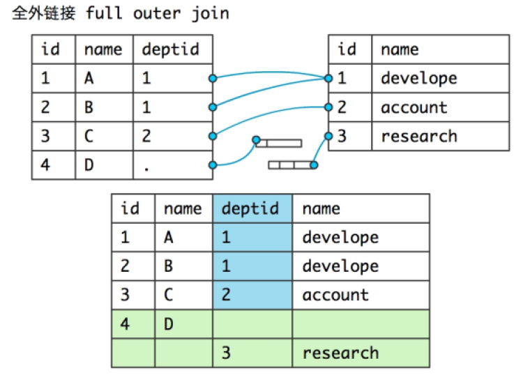

# 关联查询

简介:

* **查询员工的first_name,部门的名字**

  * 错误❌的写法 - 笛卡尔积.

    ~~~java
    
    ~~~

  * 传统的写法

    ~~~sql
    
    ~~~

  * 关联查询使用join .. on(一定是一起使用的)

    ~~~sql
    
    ~~~
    
    

# 关联查询练习

查询出员工的first_name,该员工的部门名字,该员工的所在部门的区域的名称.

~~~sql
mysql>
~~~

on并不是用来替代where,上面的题中增加一个业务.找出区域'Asia'上的所有的员工的名字,部门名字,区域名字.

~~~sql
mysql>
~~~

找出部门是31的部门的名称,以及该部门的所有的员工的名字和工资

~~~mysql
mysql>
~~~

找出欧洲区域上所有的员工的名字,区域名称.

~~~mysql
mysql>
~~~

查询所有客户的id,名称以及该客户拥有的订单的所有的信息

~~~mysql
mysql>
~~~

# 关联查询-连接的方式

* **内联方式**

 

* ***左外联 - 左连接***

    

* 右连接

   

* 全连接

  A full outer join B

  mysql中不支持这个语法

   

## 练习 - 自关联

* 查询员工名字以及该员工的上司的名字

  ~~~sql
  mysql>
  ~~~
  

  
* 查询员工名字以及该员工的上司的名字,即使这个员工没有上司,也要查询来.

  ~~~sql
  mysql>
  ~~~
  

# 多行函数

简介:多行函数 - 组函数.

* count(n)

  n可以为*,可以为具体的某列.统计行数的,重复的数据也算1个.

  注意:如果碰到null值列,那么直接跳过了,不计数.

  ~~~sql
  
  ~~~
  
* avg(n);

  求出某列的所有行的平均值.

  ~~~mysql
  -- 求出所有员工的平均月薪
  
  ~~~

* max(n),min(n)

  ~~~mysql
  -- 求出员工表中工资最高的工资和最低的工资
  
  ~~~

* sum(n)

  ~~~mysql
  -- 求出员工表中所有的员工的工资总和
  mysql>
  ~~~

  注意:使用sum进行统计的时候,如果遇到null值,忽略null

## 使用的注意点

查询的列中是否可以出现普通列? - ×

~~~mysql
mysql>
~~~

# 分组查询

~~~sql
select 列1[,列2],组函数(多行函数)
group by 列1[,列2]
having 组函数的判断
order by 排序
~~~

* 统计各个部门的人数(部门的id和该部门的员工的数量)

  ~~~sql
  mysql>
  ~~~
  
* 统计各个职称的员工的数量

  ~~~sql
  mysql>
  ~~~

* 统计各个区域的id和区域的部门数量

  ~~~sql
  mysql>
  ~~~

* 统计各个部门的id,名称以及这个部门的员工的数量

  ~~~sql
  mysql>
  ~~~
  
  

* 统计各个区域的id,名称以及这个区域的员工的数量

  ~~~sql
  mysql>
  ~~~
  
* 统计各个客户的订单的数量,没有订单的客户也要统计

  ~~~sql
  mysql>
  ~~~

## having 组函数判断

简介:where和having使用时候的区别

1. where是条件过滤,是在分组之前的过滤,不能使用组函数.
2. having是在分组之后的进一步过滤,允许使用组函数的.

* 查询出平均工资超过1300的部门的名称和这个部门的平均工资

  ~~~sql
  mysql>
  ~~~
  
* 统计本公司的职称的数量.

  ~~~sql
  mysql>
  ~~~

* 统计没有订单的客户信息

  ~~~sql
  mysql>
  ~~~
  
* 统计人数超过3个员工的部门编号和部门名称

  ~~~sql
  mysql>
  ~~~
  
* 统计除了'Asia'之外的各个区域的id,name以及这个区域的人数(4个),并且根据人数降序排序

  

  ~~~sql
mysql>
  ~~~

* 查询出各年份入职的员工情况（年份，员工人数）

  ~~~mysql
  mysql>
  ~~~
  
* 查询出每年每月入职的员工情况（年份月份，员工人数)

  ~~~mysql
  mysql>
  ~~~

# 子查询

定义:查询中嵌套查询.注意点:子查询一定要使用()括起来.

子查询可以出现的位置:

* 作为外部查询的条件
* 作为外部查询的列
* 把子查询的结果作为"虚表",一定要给"虚表"取别名

## 练习

* 子查询作为外部查询的条件.

  查询出比Mark员工工资高的员工的名字和工资信息

  ~~~mysql
  
  ~~~
  
* 子查询出现在外部查询的select列中

  查询出比Mark员工工资高的员工的名字和工资信息

  ~~~sql

  ~~~
  
* 子查询查询出来的结果 - "表"

  ~~~mysql
  
  ~~~

## 课堂练习

* 找出各个部门的id,name以及这个部门的员工的数量

  ~~~sql
  mysql>
  ~~~
  
* 找出平均工资大于公司平均工资的部门编号和平均工资

  ~~~sql
  mysql>
  ~~~
  
* 找出与'Ben'同部门的员工和部门编号

  ~~~sql
  mysql>
  ~~~
  
* 查询出客户名,电话号码以及订单数量

  ~~~sql
  
  ~~~

## 子查询的分类

* 相关子查询 - 子查询中使用到了外部查询的列.子查询是不能够独立运行的.

  ~~~sql
  
  ~~~
  
* 无关子查询 - 子查询中没有使用到外部查询的列,子查询是允许单独执行的.

  ~~~sql
  
  ~~~
  
* 关联查询

  ~~~sql
  
  ~~~

只用原则:关联查询>无关子查询>相关子查询.

# exists和not exists用法

* exists 关心条件为true - 是否存在
* not exits 关心条件为false - 不存在

不关心查询出来的是什么,只关心能不能查询出来

~~~sql

+----+----------------+-----------+
~~~

* 找出与'Ben'同部门的员工

  ~~~sql
  
  ~~~
  
* 找出各个部门工资排名前二的员工

  前提是 - 相同工资不超过2个.

  ~~~sql
  -- 在"我e"这个部门中,如果有人的工资比"我e"还要高,那么这个人的数量不能超过1个.
  
  ~~~
  
  ~~~sql
  -- 不存在,在"我e"这个部门中,有人的工资比我高,并且这个数量超过1.

  ~~~
  
* 找出各个部门中工资最高的员工.

  思路:本部门中比'我'工资高的员工不超过1个.

   本部门中不存在比'我'工资还要高的员工(数量>0)

  ~~~sql
  mysql>
  ~~~

# 求出查询结果的并集,差集,交集.

* 并集 - union     union all
* 差集
  * oracle中可以直接使用minus关键字

* 交集
  * oracle可以使用intersect关键字

